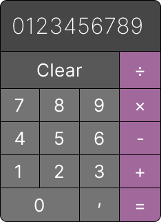

# Project: Calculator

This project is a simple calculator web application that allows users to perform basic arithmetic operations such as addition, subtraction, multiplication, and division. The application has been implemented using HTML, CSS, and JavaScript.

### Preview

### Usage

To use the calculator, simply click on the number buttons to input your desired numbers. Then, click on one of the operator buttons to select the operation you would like to perform. Finally, click on the equals button to see the result. You can also use the clear button to reset the calculator.

### Features

- Simple and easy-to-use user interface
- Performs basic arithmetic operations
- Displays the result in real-time
- Allows users to clear the input and start over
- Handles division by zero errors gracefully

### Technologies Used

- HTML
- CSS
- JavaScript

### Author

- This project was created by Vladimir Egorov.
- Project: Calculator. Foundations Course. The Odins Project.
